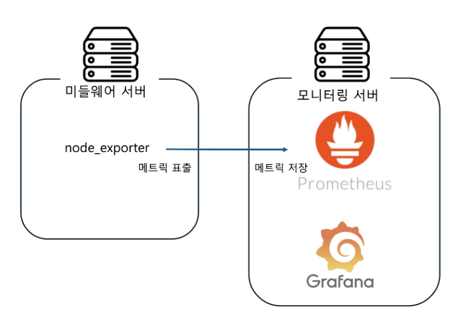

# gb-monitoring

## 모니터링

### 아키텍처


### 기술

#### Node Exporter
모니터링 대상인 미들웨어 서버에 설치되어, 하드웨어 정보를 http 통신으로 표출

#### Prometheus
수집(모니터링) 서버에 설치되어, 필요한 메트릭을 저장 및 조회

#### Grafana
수집(모니터링) 서버에 설치되어 Prometheus에 저장된 메트릭을 대시보드를 통해 시각화

---

## 로그 분석

### 기술

#### Promtail
1. 가공된 로그 데이터를 http 통신으로 수집 서버의 Loki에 전송
2. position.yml을 통해 마지막 전송 로그 위치 저장 및 관리

- Middleware
  - 로그 수집 대상인 미들웨어 서버에 설치
  - Middleware 로그의 디렉토리를 변경 없이 직접 path 지정

- Edge
  - 수집 서버에 설치
  - Edge별 grpc 로그를 수집 서버에 다운로드 후, Edge 로그 수집
  - Edge 로그를 다운로드 받은 수집서버의 디렉토리를 path 지정

#### Loki
수집 서버에 설치되어, Promtail로부터 수신된 로그 데이터를 필요에 따라 저장 및 조회

#### Grafana
이미 미들웨어 모니터링을 진행 중인 수집 서버의 Grafana를 이용하여 Loki 데이터를 대시보드를 통해 시각화

### Edge 로그 수집

#### 요구사항
- [x] md5 digest해서 원본, 다운로드 받은거 일치 여부 판단 후 원본 삭제
- [x] Edge의 `grpc_log`, `redis_log`, `api_log` 로그 수집 및 삭제 적용

#### 실패 시, Retry Rule
- 기본 1회 재시도
  - 실패 시, 재실패 규칙 실행 후 다음에 재시도
    ```
    <재실패 규칙>
    
      - '파일명 변경' 실패 시, 리턴
      - '원격 파일 MD5 계산'이나 '다운로드' 실패 시, 해당 원격 파일 이름 변경
        - 이름 앞에 '{파일 종류}\_DF\_' 붙이기 (ex. 'redis_DF_20250124_redis_log.log')
      - '원격 파일 삭제' 실패 시, 해당 원격 파일 이름 변경
        - 이름 앞에 '{파일 종류}\_RF\_' 붙이기 (ex. 'redis_RF_20250124_redis_log.log')
    ```
- 'redis_DF_20250124_redis_log.log' 와 같이 파일 이름에 '\_DF\_' 가 포함된 경우
  - 해당 파일을 '20250124_redis_log.log' 와 같이 원격 파일 이름 변경 후 바로 'MD5 계산 (원격 파일)' 단계부터 실행
- 'redis_RF_20250124_redis_log.log' 와 같이 파일 이름에 '\_RF\_' 가 포함된 경우
  - 해당 파일을 삭제 단계부터 실행
- 원격 파일 삭제까지 완료 후, 해당 로컬 파일 다른 로컬 디렉토리로 이동
